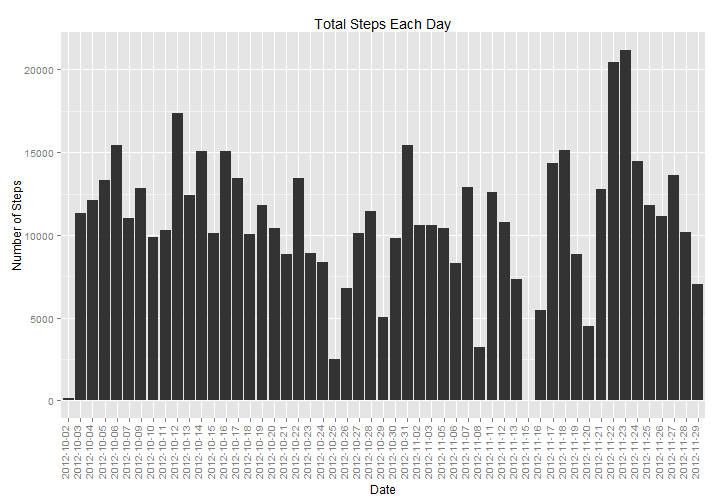
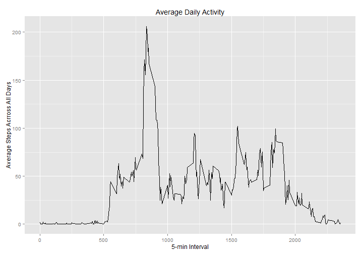
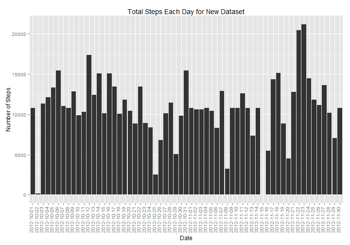
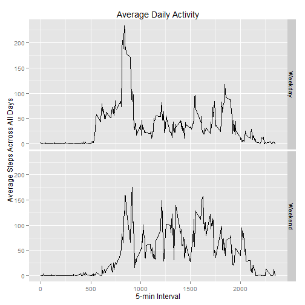

## About

This is the first project for the Reproducible Research course in Coursera's Data Science specialization track. The purpose of the project is to answer a series of questions using data collected from a personal activity monitoring device.   
This device collects data at 5 minute intervals through out the day. The data consists of two months of data from an anonymous individual collected during the months of October and November, 2012 and include the number of steps taken in 5 minute intervals each day..

## Loading and preprocessing the data


```r
activity <- read.csv("./data/activity.csv", colClasses = c("numeric", "character","numeric"))
head(activity)
```

```
##   steps       date interval
## 1    NA 2012-10-01        0
## 2    NA 2012-10-01        5
## 3    NA 2012-10-01       10
## 4    NA 2012-10-01       15
## 5    NA 2012-10-01       20
## 6    NA 2012-10-01       25
```

## What is mean total number of steps taken per day?

- Sum steps by day.
- Create Histogram.
- Calculate mean and median.

 

The mean is 1.0766189 &times; 10<sup>4</sup> and the median is 1.0765 &times; 10<sup>4</sup>.

## What is the average daily activity pattern?

- Calculate average steps for each interval for all days.
- Plot the Average Number Steps per Day by Interval.
- Find interval with most average steps.
 

835 is the 5-minute interval which contains the maximum average number of steps across all the days.

## Imputing missing values

As thers are a number of days/intervals where there are missing values (coded as NA).


```r
Noncompletecases=sum(!(complete.cases(activity)))
```

There are 2304 of missing values in the dataset.

We are  going to use a strategy for filling in all of the missing values in the dataset. This strategy will be the the mean for that 5-minute interval.


```r
Newactivity=activity
for (i in 1:nrow(Newactivity)) {
      if(is.na(Newactivity$steps[i]))  {
      Newactivity$steps[i]= steps_by_interval$steps[steps_by_interval$interval==Newactivity$interval[i]]
            }}
head(Newactivity)
```

```
##       steps       date interval
## 1 1.7169811 2012-10-01        0
## 2 0.3396226 2012-10-01        5
## 3 0.1320755 2012-10-01       10
## 4 0.1509434 2012-10-01       15
## 5 0.0754717 2012-10-01       20
## 6 2.0943396 2012-10-01       25
```

For the new Data set we will do the following:
-Sum steps by day.
-create Histogram.
-calculate mean and median.

 
The mean of the new dataser is 1.0766189 &times; 10<sup>4</sup> and the median is 1.0766189 &times; 10<sup>4</sup>.

**So after filling the missing values, the mean is the same but the median is a little bit different**

## Are there differences in activity patterns between weekdays and weekends?

Using the weekdays() function, we add another column in the activity Dataset which defined if the date is weekend or weekday.


```r
activity$date=as.Date(activity$date)
weekday <- weekdays(activity$date)
for (i in 1:nrow(activity)) {
    if (weekday[i] == "Saturday" | weekday[i] == "Sunday") {
        activity$daylevel[i] <- "Weekend"}
    else {activity$daylevel[i] <- "Weekday"}
}
activity$daylevel <- factor(activity$daylevel)
```

Make a panel plot containing a time series plot of the 5-minute interval (x-axis) and the average number of steps taken, averaged across all weekday days or weekend days (y-axis).


```r
steps_by_interval2 <- aggregate(steps ~ interval+daylevel, activity, mean)
qplot(interval,steps,data=steps_by_interval2,facets=daylevel~.,geom="line",stat="identity",main="Average Daily Activity",xlab="5-min Interval",ylab="Average Steps Acrross All Days")
```

 
